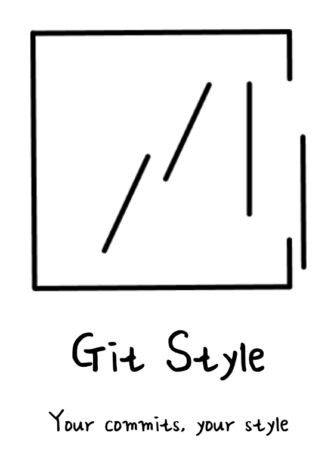

<div align="center">
  
</div>

<br />

- [한국어](./docs/README-ko.md)
- [git-style.vercel.app](https://git-style.vercel.app)

<br />

> Turn your GitHub contributions into beautiful visuals. Style your commits your way.


## Usage

1. Pick a theme and style.
2. Enter your GitHub username.
3. Paste the generated markdown into your `README.md`.

## Themes

| Theme | Status |
|-------|--------|
| Flower | Available |
| Cloud | Soon |
| Hair | Soon |

### Flower

Customize flower type and color.

**Types**: `default`(Daisy), `tulip`, `sunflower`, `cherry`

**Query Parameters**

| Param | Description | Default |
|-------|-------------|---------|
| `flower` | Flower type | `default` |
| `color` | HEX color code | `#fbbf24` |

## Development

```bash
pnpm install
pnpm dev
```

## License

MIT
